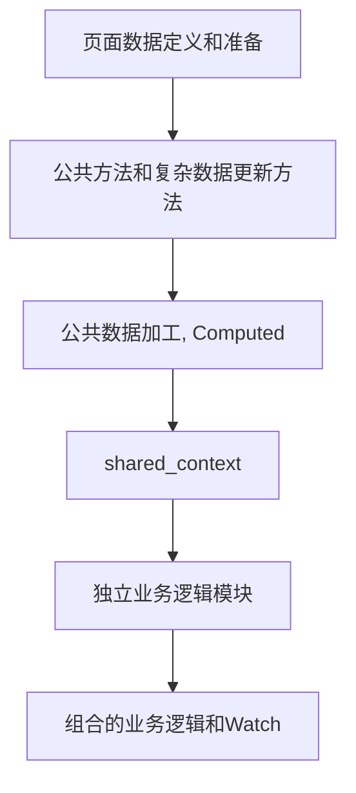
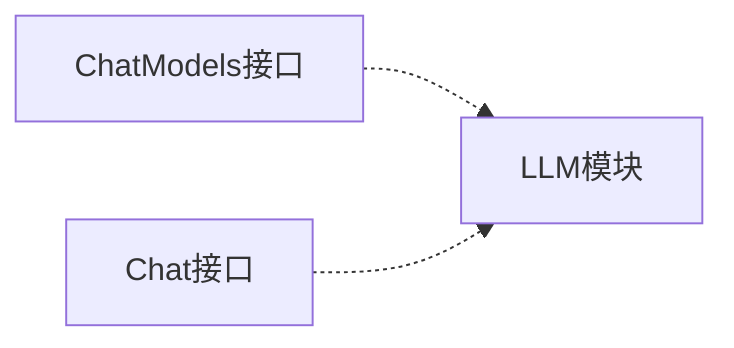
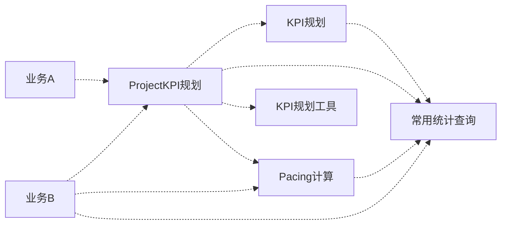

[TOCM]

# 前置知识

## [Nuxt](https://nuxt.com/)

**基础Nuxt知识，请查阅官方文档**

### 项目中使用Nuxt主要内容

- Nuxt框架壳、文件夹规范、Nuxt开源生态基础框架
- AutoImports - 自动导入
  - 文件夹：Utils、Components、Composables、
- 前后端的文件路由规范

### 重点知识

**特别注意：**

- 全局前端为(client + ssrServer)， 全局后端为(nitroServer)
- 注意区分 打包时和运行时
  - nuxt.config， 只有runtimeConfig才会运行时变化。其他都是打包时候确定的
  - app.config， 打包时默认。运行时可更新「规范不允许更新」
  - module入口文件，仅在打包时起作用


### 模块中常用的 nitropack 工具「更多工具‘build_utils.ts’」

- addTemplate：可以一起打包使用的js/ts文件模版，相当于给项目增加额外的js
- addImports： 全局前端文件/文件夹(含ssr)
- addComponent： 全局前端组件
- addPlugin/addPluginTemplate：全局前端插件 / 插件模版
- addRouteMiddleware： 前端中间价
- addServerImports： 全局nitroServer的文件/文件夹
- addServerHandler： nitroServer的EventHandler
- addServerPlugin： nitroServer的Plugin
- addTypeTemplate： 类型模版文件
- addDevServerHandler： dev时的nitroServer

## 基础技术框架

- [element-plus](https://element-plus.org)
- [unocss](https://unocss.nodejs.cn)
- [dayjs](https://dayjs.fenxianglu.cn)
- [mikro-orm](https://mikro-orm.io)
- [lodash-es](https://www.lodashjs.com)
- [vueuse](https://vueuse.nodejs.cn)
- [unjs](https://unjs.io) Nuxt基于unjs生态圈
  - ofetch
  - defu
  - destr
  - consola
  - magic-regexp
  - nitro / h3
  - ohash
  - pathe
  - hookable
  - unstorage
  - unbuild
  - unimport
  - untyped
- [nanoid](https://github.com/ai/nanoid) 简单快速的ID生成工具
- Markdown 「TODO：支持渲染、编辑、AST」

# 基础项目

## 基础项目做了什么？做的目的是？

**目的：**

- 写业务和使用的时候有标准可依赖，减少无从下手和五花八门
- 写代码更舒服，不会老是卡着难受
  - 某些业务写起来很难受，卡着不好写？
  - 某些业务基础项目做不到或者不好做？ 要改善。
- 沉淀更多基础功能和业务模块
  - 加快开发速度。
  - 减少重复造轮子，提倡优化轮子。
- 形成业务例子和业务模版
  - 更好的学习
  - 更快的开发速度

**定义整体标准**

- 目录结构
- 项目配置「Config」
- 开发规范 和 样例
- Import 和 Export「Expose」
- 模块定义标准
- 公共的方法使用标准
- 复杂业务开发样例和标准
- UI规范

**提供基础功能和功能标准**

- Base模块内置基础功能
- Request功能 和 标准
- 日志功能
  - TODO
- 数据库操作
  - CURD
  - 关系描述
  - 统计使用
    - total、items
    - 直接填充字段「populate」、 额外查询并返回「返回： items、records」
    - TODO：
      - 统计表自动匹配
      - 兼容query
- 根据业务封装Nitro提供的功能 「TODO」
  - Cache、KVStorage
- 更方便的Const定义和使用
- Utils - 需要大家一起的完善
  - $ServerUtils
  - $WebUtils
- Formatter「Fmt」- 需要大家一起的完善
- Rule And RuleValidate 「DTO」
  - 需要更加好用和完善
- 更多统一的基础功能：columns、 I18n

**业务例子**

- 业务开发例子
  - 基础业务例子
  - 复杂业务例子
  - TODO： Form开发标准和例子
- 有待完善
  - 更多的业务例子
  - 形成一些开发模块
  - 形成一些基础功能使用的文档


## 开发规范

### 开发任务规范

**群上的图片**

### 编码规范

#### 命名规范

- 全大写下划线命名法（ `CONSTANT_CASE` ）
  - 全局常量
- 帕斯卡命名法（ `UpperCamelCase` ）
  - 类名、~~类文件、Model文件、组件文件名~~、局部常量
  - `E`开头的枚举值集合： `EUpperCamelCase`；属性使用大驼峰。
  - `I`开头的类型命名 `IUpperCamelCase`。如： 重名类型、常用类型、全局类型。
  - `C`开头的常量命名 `CUpperCamelCase`。由`defineConstants`生成的常量，其属性使用 **全大写下划线命名法（ `CONSTANT_CASE` ）**。
- 驼峰式命名法（ `lowerCamelCase` ）
  - 函数名、方法名、类方法名
- 下划线命名法 ( `variable_name` )
  - 参数、变量、属性
  - 所有文件名称、文件夹名称
- 下划线前缀命名法 ( `_variable_name` )
  - 私有变量、私有属性、函数内的局部变量、函数内的私有变量
- 下划线前缀驼峰式命名法（ `_lowerCamelCase` ）
  - 私有函数、私有类方法、私有类方法
  - 函数内的局部方法、函数内的私有方法

**样例**

```ts
// 全局常量
const DEFAULT_PARAM_KEY = 'param';

// 表单状态枚举集合
enum EFormStatus {
  AddStatus = "任意值1",
  EditStatus = "任意值2",
}

// 常用类型、全局类型。
export type IUseAPIRequestContext<API = unknown> = APIRequestContext<API> & CommonAPIRequestContext & Partial<ExtraAPIRequestContext>;

// 常量定义
const _const1 = defineConstants(
  [
    { key: 'TotalBudget', label: "Total Budget", value: 1 },
    { key: 'TotalCost', label: "Total Cost", value: 2 },
    { key: 'TotalRevenue', label: "Total Revenue", value: 3 },
  ] as const,
  ['LIST', 'KV', 'VALUES', 'MAP', 'MAP_BY_VALUE'] as const,
);
export const CAmountAdjustmentType = {
  ..._const1,
  // 额外的属性
  AGENCY_ADJUSTMENT_TYPES: [_const1.KV.AgencyFee, _const1.KV.AgencyRebate],
}
```

#### 基础范例子

**函数定义**

```ts
// 定义函数
interface Context {} // 运行需要的上下文
interface AddFnParam {} // 函数的参数
interface AddFnOptions {} // 函数的选项
// 方式1：统一参数
const addFn = (ctx: Context, param: AddFnParam, options: AddFnOptions) => {} // 上下文、参数、选项
// 方式2：拥有1、2个主参数
const addFn = (ctx: Context, param1: string, param2: AddFnParam, options: AddFnOptions) => {} // 上下文、参数、选项
const addFn = (ctx: Context, param1: string, param2: object, param3: AddFnParam, options: AddFnOptions) => {} // 上下文、参数、选项
```

**不写有副作用的代码**

```ts
// 不允许直接修改外部变量
function handler(arr: object[]) {
  // 不允许此写法
  arr.forEach((item) => {
    item.a = 1;
  });
  // 推荐1:
  const new_arr = arr.map((item) => {
    return {
      ...item,
      a: 1
    }
  });

  // 推荐2:
  const new_arr = [];
  for (const item of arr) {
    new_arr.push({
      ...item,
      a: 1
    })
  }
}
```

### ServerErrorCode规范 「有点麻烦再整理一下，更好用的」

> 背景和说明： 
>  - 使用数字Code， 不好记忆，无法理解。
>  - 没有进行很好的错误Code分段
>  - 本次又使用了数字。
>  - 其实很多ServerError可以通用Code。msg不一样


**规范： 应用标识(100) + 错误编号(0000)**

**全系统公共错误 「100 + xxxx」**

- 输入相关错误
  - 基础的数据格式
  - 接口参数
  - 函数方法输入参数  
  - 超限相关错误，如：QPS、XX锁定、XX超次数
- 数据错误
  - 基础DB错误
  - KV数据库错误
  - 缓存数据错误
  - 数据结果错误，如：查询数据过长、
  - 资源相关错误
- 公共业务相关错误
  - 
- 鉴权相关错误
  - 登陆鉴权的错误
  - 用户错误
  - 账号错误
  - 授权错误
  - 用户+账号+组织关系的错误
  - 用户+X+权限的错误
- 服务器程序错误
- 跨应用相关错误
  - S2S错误
  - C2S错误
- 任务运行相关错误
  - 
- 公共模块自定义错误
  - 

**应用内部自定义错误 「xxx + xxxx」**

- OpenApi相关错误 「xxx + 9xxx」
  - 
- 当前应用自定义的业务错误

#### ServerError使用

**定义错误**

```ts
const genCode = (code: number | string) => +`1005${code}`

/**
 * - 服务器程序错误
 *  - 
 */

export const DefinedError = defineServerAppError({
  // 服务器程序错误,
  SystemError: {
    name: "SystemError",
    code: genCode('0000'),
    message: "服务器错误",
    message$en: "System Error",
  },
})

// 可选
export const ErrorAssert = defineServerAppErrorAssert(error => {})


export interface IDefinedErrorParam {}

export interface IDefinedErrorData {}
```

**安装错误**

```ts
addServerAppErrors(
  { file: resolve('./runtime/server/error.ts') },
  { dir: resolve('../node/errors') },
  { dir: resolve('../../src/server/errors') }
)
```

**使用ServerAppError**

```ts
throw new ServerAppError('SystemError')
```

## 项目核心内容

### 整体目录结构

```
|-- libs 公共lib子库
|   |-- base - 项目的基础功能模块。
|   |-- build - 项目构建时的功能代码「额外build功能、rollup插件」
|   |-- common - 前后公共功能的目录
|   |   |-- columns - 通用的表格列配置。使用范围：ui表格、导出表格
|   |   |-- const - 公共常量
|   |   |-- formatter - 公共格式化工具
|   |   |-- i18n -  i18n翻译文件
|   |   |-- rules - 基础验证模块 「看是否能够更加贴近业务」
|   |   |   |-- items - 公共的ruleItem
|   |   |   |-- validator、web、server - 验证功能函数
|   |   |-- utils - 前后端公用的utils
|   |-- modules - 公共模块目录
|   |   |-- mikro - MikroORM模块 
|   |   |-- i18n 
|   |-- node - 公共的node
|   |   |-- error 错误处理模块
|   |   |   |-- handler 统一错误处理函数
|   |   |-- model 数据模型
|   |   |   |-- base 基础model
|   |   |   |-- xxxx 各个系统的model
|   |   |   |-- statistics 统计相关Model
|   |   |-- services Server端公共服务
|   |   |-- utils - Server端使用的utils
|   |-- types - 公共TS类型文件
|   |-- web - 公共的Web
|   |   |-- components 公共组件
|   |   |-- composables 公共hook
|   |   |-- pages 公共页面
|   |   |-- utils - Web端使用的utils
|   |-- build_utils.ts - 模块构建时使用的工具函数
|   |-- nuxt.config - 基础的nuxtConfig
|-- src APP文件资源目录
|   |-- features「TODO」 - 未达到模块那么大，仅存放当前App特定功能的文件夹。如：
|   |   |-- kpi_draft - kpi草稿功能，如：「文件例子」
|   |   |   |-- draft.ts - 公共草稿功能
|   |   |   |-- draft.web.ts - Web端的草稿功能
|   |   |   |-- draft.server.ts - Server端的草稿功能
|   |   |-- kpi_calendar - kpi日历功能，如：「文件夹例子」
|   |   |   |-- common - 公共的KPI日历功能
|   |   |   |-- web - Web的KPI日历功能
|   |   |   |-- server - Server的KPI日历功能
|   |-- 其他基本和Nuxt一致
|-- .env.template 环境变量模版
|-- .env 环境变量，不提交的本地文件
|-- env.d.ts 环境变量的类型声明文件
|-- nuxt.config - 项目的nuxtConfig
|-- tailwind.config - 项目的tailwind配置
```

### 功能目录标准

- **主目录下的功能目录规范** `src目录下`
  - components - APP全局公共组件
  - ...nuxt其他目录
  - features
    - chat // 聊天功能模块
      - components // chat组件
      - context // web的chat业务的上下文
      - dto // 前后端公用的数据传输对象
      - server // chat服务端功能
        - context // server端的业务上下文
      - ***** 特殊情况，使用文件命名区分 ******
      - xxx.node.ts // 仅服务端功能
      - xxx.web.ts // 仅前端功能
    - xxx // 其他功能模块
- 模块目录下的功能目录规范。 `自定义模块`  **由于模块目录已经限定范围，再使用 `features`目录进行约束会导致目录太深**
  - components // ai-chat模块组件
  - ...nuxt其他目录
  - dto // 前后端公用的数据传输对象
  - llm // 前后端公用的大语言模型对接
  - chat_context // web的chat业务的上下文
  - server
    - 纯后端功能


### Config配置标准

**配置有哪些？**

- 打包时的配置Options
- RuntimeConfig 「运行时配置」
- AppConfig
- 模块配置

**项目配置分类与Nuxt配置分类一致**

- RuntimeConfig: 打包时可以设置默认值。运行时可以动态配置。仅服务端使用。
- PublicRuntimeConfig: 打包时可以设置默认值。运行时可以动态配置。前后端公用。
- AppConfig：当前App应用配置，打包时候确定。前后端公用。运行时可以Update「但禁止Update」


#### 模块配置定义标准

**定义如下：**

```ts
/** 定义TS类型 */
declare module "nuxt/schema" {
  /** Demo模块运行时服务端配置 */
  interface ModuleRuntimeConfig {
    [MODULE_NAME]?: { sk: string }
  }
  /** Demo模块运行时公共配置，前后公共配置不含敏感信息 */
  interface ModulePublicRuntimeConfig {
    [MODULE_NAME]: { name: string, record: Record<string, string> }
  }
}

BuildUtils.defineModuleRuntimeConfig(MODULE_NAME, { 
  // 指定默认值和指定TS类型
  // name: MODULE_NAME,
  // record: { demo: true },
  $schema: { tsType: `ModuleRuntimeConfig['${MODULE_NAME}']` } 
});
// 仅指定TS类型
BuildUtils.defineModulePublicConfig(MODULE_NAME, { $schema: { tsType: `ModulePublicRuntimeConfig['${MODULE_NAME}']` } });

/** 手动添加Schema例子，并附加默认值 */
// BuildUtils.defineModulePublicConfig(MODULE_NAME, {
//   name: MODULE_NAME,
//   record: { demo: true },
// }, {
//   title: 'Demo Module Public Config',
//   properties: {
//     // 手动指定复杂的Ts类型，不然会解析成常量
//     record: { tsType: 'Record<string, string>' }
//   }
// })
/** 
 * 定义模块APP配置。
 * - 打包时候确定。前后公用，而且可以修改。
 * - APP配置更多指向APP概念，模块不推荐使用。且ModulePublicConfig有类似能力。
 */
BuildUtils.defineModuleAppConfig(MODULE_NAME,
  {
    name: MODULE_NAME,
    func: { name: MODULE_NAME },
  },
  {
    /** 按schema定义。 */
    title: `${MODULE_NAME} Module App Config`,
    properties: {
    //   name: { tsType: `"${MODULE_NAME}"`, default: MODULE_NAME, title: 'Name' },
    //   func: { title: 'Func', tsType: 'any' }
    }
  }
);
```

**为了方便管理模块的配置，使用方式如下： 「特别的AppConfig集成类型会出错」**

```ts
export const demoConfig = defineNuxtModuleConfig("demo", {
  options: {
    // 按照模块页面到APP
    pages: [{ prefix: "/demo" }],
    apis: [
      {
        prefix: `${API_PREFIX}/demo`,
        // 手动添加局部中间件，相对server目录
        middlewares: ["./middleware/demo.ts"],
      },
    ],
  },
  public: {
    name: "public",
    record: {},
  },
  runtime: {
    sk: `${ENV.M_AUTH_EXPIRED_TIME}`,
  },
});
```


### 自动导入、Import标准、Export标准

#### 基础导入

```ts
// 相对路径
import { fn } from '../func/fn';

// !! 一般情况下 index 文件用于reexport 、 模块的关键函数、模块入口函数
import { main, fn } from '../func/index';

// 标准的基础功能均使用别名方式导入。 如下：
import { MemoryRecordCache } from '@Web/utils/memory_record_cache'
import { readMultipartForm } from "@Node/utils/multipart";
import { createUrlGenerateFn } from '@Libs/common/utils/path/tokenizer_parser';
import { CommonColumns, type CommonColumnKeys } from '@Columns/common';
```

**问题：出现大量import。很多项目规范选择在index文件进行 reexport**


#### Nuxt的全局导入「unjs/Unimport」

```ts
interface UnimportOptions {
  /** 导入到全局 */
  autoImport?: boolean;
  /** 指定单个文件内的某一项导入 */
  imports: Import[];
  /** 导入整个文件夹内的文件。 「重名会覆盖」 */
  dirs?: string[];
  /** 一般用于依赖包的导入 */
  presets: (Preset | BuiltinPresetName)[];
}

// 由于全局导入了Vue依赖包。 可以直接使用vue的函数
ref()
defineProps()

// 同理全局导入自定义的函数 和 类型
useAPIRequestContext();
const ctx: IUseAPIRequestContext  = {}

// 没有全局导入的也可以使用构建的别名进行使用
import { useNuxtApp } from '#imports'
import { ElMain } from '#components'
```

**全局导入会存在滥用和过多问题：**

- 编辑器占用资源会增加。导致机器压力大，编码时卡顿
- Nuxt+Vue「大概100多个」 + 业务增长 --> 500 ？ 1000？出现大量重名、开发的人没办法区分情况该用哪个
- 没有单文件导入
- 文件夹导入重名覆盖

**解决方案：**

- 支持单文件全局导入
- 整合功能导入到全局变量中
- 整合功能在特定文件Reexport

#### 单文件全局导入

```ts
const conf = {
  import_files: [
    { 
      file_path: resolve('./common/rules/validator.ts'), 
      import_server: true, 
      import_web: true 
    },
  ]
}

// 使用
ruleValidate(rule, data);
```

#### 整合功能导入到全局变量中

```ts
const conf = {
  exposes: [
    /** 全局的格式化函数导入 */
    {
      name: 'fmt',
      comment: '/* 全局格式化函数 */',
      dirs: [resolve('./common/formatter')],
      root_vars: ['index'],
      expose_server: true,
      expose_web: true,
    },
    /** 前端Util导入 */
    {
      name: 'web_utils',
      comment: '/* Web Utils 前端Utils */',
      group_strategy: 'dirname_group', // 按照目录分组
      dirs: [
        resolve('./common/utils'),
        resolve('./web/utils'),
        resolve('../src/utils'),
      ],
      expose_web: true,
    },
    /** 已废弃：常量全局导入。 影响资源加载，统一修改成reexport。 */
    {
      name: 'const',
      comment: '/* Global Constants 全局常量 */',
      dirs: [resolve('./common/const')],
      ignore: ['**/defineConstants.ts'],
      group_strategy: 'filename_group', // 按照文件分组
      expose_web: true,
      expose_server: true,
    },
  ]
}

/** 使用 */
// 正常导入有类型
import { EFormStatus } from '@Const/common/form';
// 快速使用，但缺少类型
import type { ChannelStruct } from '#expose/const'
import type { CommonFindParam } from "#expose/server_utils";
const { 
  IoMaterial: { NestingOfficeTeams, CPersonnel }
} = $Const;

// 通过分组能够清晰知道。 Web的工具函数。 Message、Path 下的xxx
$WebUtils.Message.showApiMessage(data, '保存账号信息错误', url);
$WebUtils.Path.withBaseURL(url)
```

**总结：该方式保留了全局使用并解决了滥用、无分组不清晰问题。 但Tree-Shaking和TS类型受到一定影响** 

#### 整合功能在特定文件自动Reexport

```ts
const conf = {
  reexports: [
    /** 公共const */
    {
      name: 'const',
      multi_file: true,
      dirs: [resolve('./common/const')],
    },
    /** 后端Model */
    {
      name: 'model',
      multi_file: true,
      dirs: [resolve('./node/model')],
      only_server: true,
    }
  ]
}

/** 使用 */
// 直接按系统导入对应的Model，方便使用。 减少import
import { 
  Personnel,
  MainBody,
  Region,
  Product,
  IOMaterial,
  IOMaterialItem,
 } from '#reexport/model/ProfitLoss';
import {
   CMainbody,
   type IMainbody,
   type IPersonnel
 } from '#reexport/const/ProfitLoss';
```

**使用对比**

```ts
// 直接import
import { CCurrency } from "@Const/common/currency";
import { CAmountAdjustmentType, type EAdjustmentStatus } from "@Const/profit_loss/amount_adjustment";
import { getPLChannels } from "@Const/common/channel";

// $Const 全局变量
import { type EAdjustmentStatus } from "@Const/profit_loss/amount_adjustment";
const {
  AmountAdjustment: {
    CAmountAdjustmentType
  },
  Channel: { getPLChannels },
  Currency: { CCurrency },
} = $Const;

// 自动reexport
import {
  CAmountAdjustmentType,
  type EAdjustmentStatus
} from '#reexport/const/ProfitLoss';
import {
  getPLChannels,
  CCurrency
} from '#reexport/const/Common';
```


### 模块定义标准

#### 模块目录结构

```
|-- demo Demo模块主目录
|   |-- runtime Demo模块运行时目录 「必」
|   |   |-- 基本和Nuxt一致
|   |   |-- expose_web.ts - 模块公共的Web功能，如：feature、utils、组件、middleware
|   |   |-- expose_server.ts - 模块公共的Server功能，如：feature、utils、services、middleware
|   |-- build  Demo模块打包时的功能目录「选」
|   |-- core  Demo模块核心功能「如：第三方模块复制的功能/对接功能」 「选」
|   |-- index.ts - 模块入口文件 「必」
|   |-- types - 类型的文件/目录 「选」
|   |-- expose_build.ts - 该模块暴露的一些打包时使用的功能 「选」
```

#### 例子

**模块入口文件「index.ts」**

```ts
import * as BuildUtils from "../../../libs/build_utils";

const { createResolver, defineNuxtModule } = BuildUtils;
const { resolve } = createResolver(import.meta.url);

interface DemoFunc { name: string; func(): void };

/**
 * 定义后端服务的上下文的类型
 */
declare global {
  /** 通用API请求上下文 */
  interface CommonAPIRequestContext {
    demo: DemoFunc
  }
  /** 额外API请求上下文，不一定存在 */
  interface ExtraAPIRequestContext {
    demo_global: DemoFunc;
  }
}
/** 
 * @description 将H3模块的类型也定义一下。 有时候vscode读取不到
 */
declare module "h3" {
  interface H3EventContext {
    demo: DemoFunc
    demo_global?: DemoFunc
  }
}

declare module "nuxt/schema" {
  /** Demo模块运行时服务端配置 */
  interface ModuleRuntimeConfig {
    [MODULE_NAME]?: {
      sk: string
    }
  }
  /** Demo模块运行时公共配置，前后公共配置不含敏感信息 */
  interface ModulePublicRuntimeConfig {
    [MODULE_NAME]: { name: string, record: Record<string, string> }
  }
  /** 
   * @description 定义更多模块钩子
   * - 底层基础功能一般用不上 
   * - 场景： A 模块依赖B模块， B模块可以添加Hook通知其他模块加载完成
   */
  interface NuxtHooks {}
}

export interface ModuleOptions {}

const MODULE_NAME = "demo" as const;
const MODULE_CONFIG_KEY = "moduleDemo" as const;

export default defineNuxtModule<ModuleOptions>({
  meta: {
    name: MODULE_NAME,
    configKey: MODULE_CONFIG_KEY,
  },
  defaults: {},
  hooks: {},
  async setup(options, nuxt) {
    const { logger } = await BuildUtils.createModuleCommon(MODULE_NAME, {
      resolve,
      // 按照模块页面到APP
      pages: [
        { prefix: "/demo" },  // 普通页面
        { prefix: "/user/demo", namespace: 'user',include: ['xxx'], exclude: ['xxx'] }, // 用户登陆后的页面
        { prefix: "/admin/demo", namespace: 'admin' }, // 管理员的页面
      ],
      apis: [{ 
        prefix: "/demo", 
        // 当前路径局部中间件
        middlewares: [resolve('./runtime/server/middleware/demo.ts')] 
      }]
    });
    /** 自动添加schema类型 */
    BuildUtils.defineModuleRuntimeConfig(MODULE_NAME, { $schema: { tsType: `ModuleRuntimeConfig['${MODULE_NAME}']` } });
    BuildUtils.defineModulePublicConfig(MODULE_NAME, { $schema: { tsType: `ModulePublicRuntimeConfig['${MODULE_NAME}']` } });
    /** 手动添加Schema例子，并附加默认值 */
    // BuildUtils.defineModulePublicConfig(MODULE_NAME, {
    //   name: MODULE_NAME,
    //   record: { demo: true },
    // }, {
    //   title: 'Demo Module Public Config',
    //   properties: {
    //     // 手动指定复杂的Ts类型，不然会解析成常量
    //     record: { tsType: 'Record<string, string>' }
    //   }
    // })
    /** 
     * 定义模块APP配置。
     * - 打包时候确定。前后公用，而且可以修改。
     * - APP配置更多指向APP概念，模块不推荐使用。且ModulePublicConfig有类似能力。
     */
    BuildUtils.defineModuleAppConfig(MODULE_NAME,
      {
        name: MODULE_NAME,
        func: { name: MODULE_NAME },
      },
      {
        /** 按schema定义。 */
        title: `${MODULE_NAME} Module App Config`,
        properties: {
        //   name: { tsType: `"${MODULE_NAME}"`, default: MODULE_NAME, title: 'Name' },
        //   func: { title: 'Func', tsType: 'any' }
        }
      }
    );
    
    /** 
     * 后端打包相关内容 
     */
    BuildUtils.addServerImports([]);
    // Demo 全局中间件
    BuildUtils.addServerHandler({ middleware: true, handler: resolve("./runtime/server/middleware/demo_g.ts") })

    /** 
     * 前端打包相关内容 
     */
    BuildUtils.addComponent({ name: 'DemoGlobalComp1', filePath: resolve('./runtime/components/GlobalComp1.vue') })
    BuildUtils.addImports([]);

    logger.success(`[${MODULE_NAME} Module]: Initialize Success`);
  },
});
```

**GlobalComp1.vue**

```tsx
<template>
  <div>Demo 模块 全局组件: GlobalComp1</div>
</template>
```

**Comp1.vue**

```tsx
<template>
  <div>Demo 模块 Shared 组件: Comp1: {{ $demo() }}</div>
</template>
```

**demo/utils/util.ts**

```ts
export const helloDemo = () => {
  console.log('helloDemo');
};
```

**将模块功能暴露出去**

```tsx
// 在模块入口暴露全局功能， 如
BuildUtils.addComponent({ name: 'DemoGlobalComp1', filePath: resolve('./runtime/components/GlobalComp1.vue') })

// 在expose中暴露。「推荐，合理的将模块内容暴露给其他使用」
// expose_web.ts
export * from './utils/util';
/**
 * 组件
 */
export { default as DemoComp1 } from "./components/Comp1.vue";
```

**使用功能**

```tsx
// 在vue中使用
<template>
  <div>
    <DemoComp1 />
    <DemoGlobalComp1 />
    {{ helloDemo }}
  </div>
</template>

<script lang="ts" setup>
// 通过模块别名导入功能
import { DemoComp1, helloDemo } from '#module/demo/web';
</script>
```

## 常用核心功能

## UI规范

**背景：** 基础UI为ElementUI。但是很多布局或者UI写起来很难受的。此时大部分项目会引入。tailwindcss、windcss、css模块。

**基础UI：** ElementUI + unocss

**如何统一的使用：**

- 统一Element 和 UnoCss的变量 「TODO：未做」
- 常用的css组合，在uno_preset中定义 

### 基础功能

#### Const

**Const定义**

```ts
// 普通枚举定义
export enum EFormStatus {
  Normal = 'Normal',
  Add = "Add",
  Edit = "Edit",
}
// 使用defineConstants vs 默认定义
export const CMainbody = defineConstants(
  [
    { key: 'Brand', id: 'Brand', label: 'Brand' },
    { key: 'Agency', id: 'Agency', label: 'Agency' },
    { key: 'Client', id: 'Client', label: 'Client' },
    { key: 'Payer', id: 'Payer', label: 'Payer' },
    { key: 'Vendor', id: 'Vendor', label: 'Vendor' },
  ] as const,
  ['LIST', 'KID', 'IDS'] as const,
);
export type IMainbody = typeof CMainbody['IDS'][number];
/** 
 * 主体类型 
 * IMainbody vs EMainbodyType 还是存在差异的
 * - EMainbodyType ts 会解析成对象， 装饰器也可以直接获取值
 * - IMainbody 只能当做类型提示使用
 */
enum EMainbodyType {
  Brand = "Brand",
  Agency = "Agency",
  Client = "Client",
  Payer = "Payer",
  Vendor = "Vendor",
};
```

**Const使用**

```ts
// 如： form表单使用
import { CMainbody } from '#reexport/const/ProfitLoss';
import { EFormStatus } from '#reexport/const/Common';

const $props = defineProps({
  value: DefinePropTypes.object<IFormData>(),
  form_status: DefinePropTypes.string<EFormStatus>(EFormStatus.Add)
});
const options = CMainbody.LIST;
```

#### Base模块内置函数

**获取页面URL**

```ts
// 获取Demo模块下的页面，并传参数
const url1 = usePageUrlGenerate('#demo:/users-:group()/:id()')({ group: 'child', id: '999' });
// 获取Demo模块的页面前缀
const url2 = usePageUrl('__prefix#demo'); //

// pages/index.vue
definePageMeta({
  preset_link: '#home'
})
// 获取预设页面，如：home页面
const url3 = usePageUrl('__preset#home');
```

**获取API_URL**

```ts
// 获取APP的URL
const api1 = useApiUrl('#app:/pl/report/list');
// 获取登陆模块下的URL
const api2 = useApiUrl('#auth:/login/password');
```


#### Utils

```ts
// 文件： common/utils/path/base_url.ts
export function withBaseURL(path?: string) {}

// 文件： web/utils/message.ts
export function showApiMessage(data: ResultData, error_title = '错误了', to?: string | null) {}

// 使用文件
$WebUtils.Message.showApiMessage(data, '保存账号信息错误', url);
$WebUtils.Path.withBaseURL(url);
```

#### Formatter「Fmt」

```ts
// 文件： common/utils/formatter/index.ts
const showText = (map: Record<PropertyKey, any>, val: any) => showName(map[val]);

// 普通使用 「直接格式化」
const text = $Fmt.amount(s_margin, 'HKD'); // 格式化货币金额
// 表格中使用 「包装成格式化函数」
const defaultPLAmountFmt = $Fmt.tableWrapper($Fmt.amount, $Fmt.tableWrapper._, 'HKD');
```
#### Rule And RuleValidate 

> 当前存在的问题：
> - 验证规则与页面是分离的
> - 数据结构定义重复，而且定义出来的规则并没有良好的字段提示
> - 页面的ifElse和验证规则的ifElse重复

```ts
// 定义公共ruleItem
const AllRuleItem = {}
export type IAllRuleItem = typeof AllRuleItem;
export default withAddContext(AllRuleItem);

// 定义Rule
/**
 * Personnel 表单
 */
export interface PersonnelForm {
  name: string;
  email: string;
  code: string;
  office: number;
  types: IPersonnel[];
}
export const PersonnelRule = defineRules((source: PersonnelForm, ctx) => {
  // 包装一个上下文
  const sc = $RuleItems.common.withContext(ctx);
  return {
    name: sc.string("请输入名称"),
    email: [sc.required("请输入邮箱"), sc.email("请输入正确邮箱")],
    code: sc.string("请输入编号"),
    office: sc.number("请选择Office"),
    types: sc.array(
      "请选择人员类型",
      sc.enum(`人员类型必须为 ${CPersonnel.IDS.join(", ")}`, CPersonnel.IDS)
    ),
  };
});

// 普通使用
const err = await ruleValidate(PersonnelRule(), data);
// 前端element使用
const { rules, form_ref, resetForm, execValidate } = useElFormValidator(PersonnelRule, form_data)
// 后端API使用
export default defineEventHandler({
  onRequest: [defineApiRequestValidator({ body: [PersonnelRule] })],
  handler: async (event) => {}
})
```

#### DB 「MikroORM」

**ORM选择**

- TypeORM   - Mongo支持不是特别友好
- MikroORM
- Prisma
  - 新的语法
  - 基于 X.prisma 文件生成ts 
  - 用过类似`GraphQL`的使用方式就比较好理解。没有的话，上手成本挺高
- Mongoose  - 只支持Mongo
- sequelize - 不支持Mongo

**为什么要使用装饰器 + Class**

- 实际的业务场景不仅仅只定义表的数据类型，还需要： 
  - 表字段的限制
  - 表与表直接的关联关系
  - 字段之间、表之间的业务规则
- 使用的时候还需要有一个类型提示
- 预定义一些数据库侧的业务规则

**简单理解 Entity 、 EntityManager 与 EntityRepository**

- Entity： 表结构、部分数据业务逻辑的描述，一个Entity可以用在多个EntityManager。 **「不对应真实的表、数据库」**
- EntityManager： 管理多个Entity，并负责链接对应的数据库和实现数据操作
- EntityRepository： 指定EntityManager，某个Entity的使用

[深入MikroORM](./mikro_orm.md)

```ts
// 定义Entity
@Entity({ datasourceName: 'demo', tableName: 'tx2' })
class Test2 extends BaseEntity {
  @Property({ type: 'string' })
  msg: string;
}

// 获取repository
const [repo, em] = $DB.getRepository(Test2);
// 查找一个实体
const entity = await repo.findOneOrFail({ id });
```

#### Statistics「统计」

**定义统计表**

```ts
export const ProfitLoss = createStatisticsTable({
  engine: 'mysql',
  datasourceName: 'mysql',
  tableName: 'profit_loss',
  column: {
    id: StatisticsColumn.id,
    ts: StatisticsColumn.ts,
  },
  dimension: {
    rule: StatisticsDimension.rule, // 公共维度
    io: { type: 'int', tsType: 'number', Model: IOMaterial, populate_fields: ['name', 'code'] },
  } as const, // 必须是const
  metric: {
    ...generateSumMetrics([
      ...PLAllAmountAmountKeys,
    ] as const),
    date: StatisticsMetrics.date,
  } as const, // 必须是const
});
export type ProfitLoss = InstanceType<typeof ProfitLoss> 
```

**统计查询**

```ts
const [pl_repo, em] = $DB.getRepository<ProfitLoss, 'mysql'>(ProfitLoss);
const result = await pl_repo.statisticsQuery(find_cond, { 
  fields: ['d_io', 'io.name', 'io.code', 's_io_revenue', 'd_date', 's_media_cost', 'd_media_cost_currency'],
  limit: 1000,
})
```

#### 公共表格列功能

- 普通公共表格列
- 统计表格列
- 导出的表格列

**定义公共表格列**

```ts
/** 公共表格列的列 */
export const CommonColumns = defineTableColumn({
  Plan: { ...PresetsColProps.id_name, prop: 'plan', fields: ['d_plan', 'plan'], label: 'TD Plan' },
  PlanName: { ...PresetsColProps.name, prop: 'plan.name', fields: ['plan'], label: 'Plan Name', },
  PlanId: { ...PresetsColProps.id, prop: 'd_plan', fields: ['d_plan'], label: 'Plan Id' },
  TDAccount: { ...PresetsColProps.id_name, prop: 'account', fields: ['d_account', 'account'], label: 'TD Account' },
});
```

**useTableColumns「表格column公共逻辑」**

```ts
  const { columns, fields, all_column_keys, column_keys } = useTableColumns([
    // IO
    PLColumns.IO,
    // TD维度
    CommonColumns.TDAccount,
    CommonColumns.Plan,
    // 非通用col, 和element使用一致
    { label: 'xxx', props: 'id', }
  ], (cols) => {
    // 计算属性。计算可用纬度
    const { dimensions, indicators } = unref(table_setting);
  
    return cols.filter(col => {
      if (dimensions.includes(col.key as IPLTableKeys)) return true;
      if (indicators.includes(col.key as IPLTableKeys)) return true;
      return false
    })
  });
```

### 基础Request功能

**功能自述：**

- 基础功能依赖ofetch。优势： 简单、前后兼容、nitro和nuxt也在使用。
  - 继承：ofetch、raw、native、crate方法
  - 扩展默认：baseFetch、apiFetch方法
- 添加预设的FetchOption功能，方便用于如下：
  - 添加默认的Option：baseURL、timeout、retry
  - 添加功能片段：get请求追加时间戳、请求签名
- 添加预设的Fetch功能，可理解为特定的请求客户端，如：
  - S2S请求客户端
  - JsonP请求客户端
  - 第三方GDT请求客户端
- 添加URL类型支持功能

#### 直接发送请求

```ts
// 有ts提示
$Request({
  url: '/api/test/one/:id',
  method: 'post',
  params: { id: 1 },
  body: { b: 12 },
  query: { q: 13 }
})

// 无ts提示
$Request.base({
  baseURL: 'http://localhost',
  url: '/api/test/one/:id',
  method: 'post',
  params: { id: 1 },
  body: { b: 12 },
  query: { q: 13 },
})

// 直接使用原始的ofetch。 ID需要拼接
$Request.ofetch('/api/test/one/1', {
  method: 'post',
  body: { b: 12 },
  query: { q: 13 }
})

// 调用raw， 获取原始http结果
$Request.raw('/api/test/one/1', {
  method: 'post',
  body: { b: 12 },
  query: { q: 13 }
})
```

**使用createApiParam 「结合APIKey和Method更方便」**

```ts
const api_param = createApiParam({
  key: '#app:/test/one/:id|default',
  method: 'post',
  params: { id: 1 },
  body: { b: 12 },
  query: { q: 13 }
})
const api_param = createApiParam({
  key: '#demo:/curd/list|get',
  query: { filter: {} }
})
$Request(api_param);

/** 普通使用 $Request + createApiParam */
const rs = await $Request(createApiParam({
  key: useApiKey('#aiChat:/chat_room/save|post'),
  body: {
    model: used_model.model,
    platform: used_model.platform,
    topic: 'New Chat',
  }
}));
/** 简写 $Request.xfetch = $Request + createApiParam */
const rs = await $Request.xfetch('#aiChat:/chat_room/save|post', {
  body: {
    model: used_model.model,
    platform: used_model.platform,
    topic: 'New Chat',
  }
})
```

**同时支持异步的 createAsyncApiParam**

#### Web端使用Hook

**简单模式直接生成state**

```ts
const s_api_param = useApiParamState({
  key: '#app:/test/one/:id|default',
  method: 'post',
  params: { id: 1 },
  query: { q: 11 },
})
const { data } = useRequest(s_api_param);
// 列表的state。简单业务推荐使用，复杂业务场景不推荐使用。
const { receiverApiResult, param: api_param, pager } = useApiListState({
  key: '#demo:/curd/list|get',
  query: { filter: {}, page: 1, size: 2 }
})
const { data } = useRequest(api_param);
receiverApiResult(data)

watch(() => toValue(data), (val) => console.log(val), { immediate: true, deep: true })
watch(() => toValue(api_param), (val) => console.log(val), { immediate: true, deep: true })
watch(() => toValue(pager), (val) => console.log(val), { immediate: true, deep: true });
setTimeout(() => {
  pager.value.page = 3;
}, 3000)
```

**复杂业务使用计算属性**

```ts
// 计算属性。该可支持大量复杂场景
const api_pager = useApiPager({ page: 1, size: 2, total: 0 });
const query_state = useApiQueryState<IUseApiKey<'#demo:/curd/list|get'>>({ filter: {}, ...unref(api_pager.pager) });
api_pager.useConnectLazyData(query_state);
// const query_state = useApiQueryState<'#demo:/curd/list|get'>({ q: 13 })
const c_api_param = useApiParam(() => {
  // 响应式逻辑
  return {
    key: '#demo:/curd/list|get',
    params: { id: 1 },
    query: unref(query_state),
  }
})
const { data: list_data } = useRequest(c_api_param);
api_pager.receiverApiResult(list_data)

watch(() => toValue(list_data), (val) => console.log(val), { immediate: true, deep: true })
watch(() => toValue(api_pager.pager), (val) => console.log(val), { immediate: true, deep: true })
watch(() => toValue(query_state), (val) => console.log(val), { immediate: true, deep: true });
setTimeout(() => {
  api_pager.pager.value.page = 3;
}, 3000)
```

#### 增加额外Api类型支持

**如： ./src/types/external-api.d.ts**

```ts
export interface ExternalApi {
  '/s2s/login': {
    get: {
      query: Record<string, any>;
    }
  }
}
```

### DTO「数据传输对象」 与 数据验证

> Server端的 类型/数据结构/Model/方法，等。 前端不应该能获取。「新版本Nuxt已经修复很多类型的获取」
> asyncValidator 
>   - 复杂数据结构无类型
>   - 数据结构要重复定义很多次。 1、接口interface结构。 2、页面data_form结构。 3、验证的结构
>   - 页面的if/else逻辑，需要重复实现。否则验证结果与ElForm不一致

**引入DTO目录和概念：** 

- 前后端公共的业务类型，尽量放在dto目录。而非type目录。
- 表单数据使用Class + [ClassValidator](https://github.com/typestack/class-validator) 定义。只需定义一次就可通用
  - TODO： 与页面表单结合。不一定是elForm，阅读过源码。elForm功能其实不多。


## 基础CURD例子

**新增和修改**

```ts
import { PersonnelRule, type PersonnelForm } from "@Rules/personnel";
import { Personnel } from '#reexport/model/ProfitLoss';


export type ApiRequest = {
  body: PersonnelForm & { id?: number; }
};

export default defineEventHandler({
  onRequest: [defineApiRequestValidator({ body: [PersonnelRule] })],
  handler: async (event) => {
    const ctx = useAPIRequestContext<ApiRequest>()
    const body = await ctx.getBody();
    const [repo, em] = $DB.getRepository(Personnel);
    
    let entity: Personnel; 
    if (body.id) {
      entity = await repo.findOneOrFail({ id: body.id })
      // 快速更新entity值, getter属性的对象则不会更新
      repo.assign(entity, body)
      // repo.assign(
      //   entity, 
      //   body, 
      //   { 
      //     mergeObjectProperties: true, // 合并对象，非覆盖
      //     updateNestedEntities: true, // 更新嵌套实体
      //   }
      // );
      // // 手动更新entity值
      // entity.code = body.code;
      // entity.email = body.email;
      // entity.name = body.name;
      // entity.types = body.types;
      // entity.office = body.office;
    }
    else {
      entity = repo.create(<any>body, { persist: true });
    }
    // 保存提交
    await em.persistAndFlush(entity);
  
    return useApiResult(entity)
  }
})
```

**获取单条**

```ts
import { Personnel } from '#reexport/model/ProfitLoss';

export type ApiRequest = {
  query: { id: number }
};

export default defineEventHandler(async (event) => {
  const ctx = useAPIRequestContext();
  const query = ctx.getQuery();
  const id = +query.id || 0;
  
  const [repo] = $DB.getRepository(Personnel);
  const entity = await repo.findOneOrFail({ id });

  return useApiResult(entity)
})
```

**获取列表**

```ts
import type { CommonFindParam } from "#expose/server_utils";
import { Personnel } from '#reexport/model/ProfitLoss';
import type { IPersonnel } from '@Const/profit_loss/io_material';

export type ApiRequest = {
  query: CommonFindParam & {
    filter: {
      deleted: boolean,
      search?: string,
      types: IPersonnel[],
    }
  }
};

export default defineEventHandler({
  handler: async (event) => {
    const ctx = useAPIRequestContext<ApiRequest>();
    const query = ctx.getQuery();
    const { find_cond, pages, orderBy } = $ServerUtils.Request.parseFindParam<Personnel>(query);
    
    const [repo, em] = $DB.getRepository(Personnel);
    const [items, count] = await repo.findAndCount(find_cond, { ...pages, orderBy })
    const pages_meta = $ServerUtils.Request.getPaginationInfo(count, pages)
        
    return useApiResult({
      items,
      meta: pages_meta,
    })
  }
})
```

**归档记录**

```ts
import { Personnel } from '#reexport/model/ProfitLoss';
export type ApiRequest = {
  query: { id: number; deleted: boolean | string; }
};

export default defineEventHandler(async (event) => {
  const ctx = useAPIRequestContext<ApiRequest>();
  const query = ctx.getQuery();
  const id = +query.id || 0;
  const del = query.deleted === 'false' || query.deleted === false ? false : true;

  const [repo] = $DB.getRepository(Personnel);
  const rs = await repo.nativeUpdate({ id }, { deleted: del });

  return useApiResult(rs)
})
```


## AIChat例子

**阅读代码**

### Vue前端

**复杂业务标准流程**



### Server后端

**背景说明：** 从历史经验来看，复杂的后端业务一般使用。IOC + 微服务。但是我们的server业务并没有那么的复杂。

**做法：**

1. 简单业务直接写在 api文件
2. 沉淀独立功能模块
3. 复杂场景组合各个功能模块的调用

**简单的LLM场景**



**复杂的KPI场景**



## 未完成功能

- 日志管理。
  - 3层日志管理。请求日志、数据库日志、运行Track日志。
  - 1、统一写入文件，Albert配合转ClickHouse
  - 2、部分写入Mongo，但是要我们自行维护。「CommonLog？？」
- Server
  - 如何跑脚步
  - bullmq
- 业务的统一功能
  - 基础通用例子、基础通用表单例子、基础通用表格例子
  - 统一上传管理
  - 统一URLQuery管理